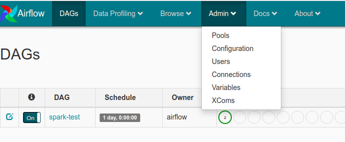
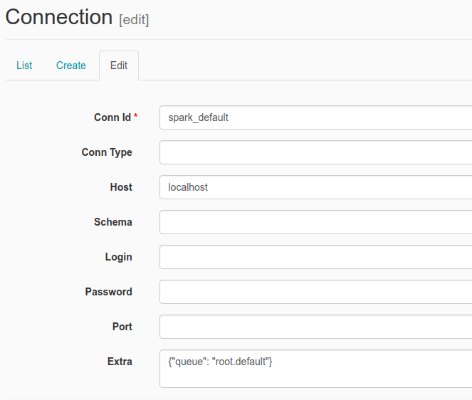

# Airflow Spark

This project contains the following containers:

* postgres: Postgres database for Airflow
    * Image: postgres:9.6
    * Database Port: 5432
    * References: https://hub.docker.com/_/postgres

* airflow-webserver: Airflow webserver and Scheduler
    * Image: docker-airflow-pyspark:latest
    * Port: 8080

* jupyter-spark: Jupyter notebook with pyspark for interactive development
  * Image: jupyter/pyspark-notebook
  * Port: 8888
  * References: 
    * https://jupyter-docker-stacks.readthedocs.io/en/latest/using/selecting.html#jupyter-pyspark-notebook
    * https://hub.docker.com/r/jupyter/pyspark-notebook/tags/

## Setup

### Clone project

    git clone https://github.com/cordon-thiago/airflow-pyspark

### Download Images

    sudo docker pull postgres:9.6
    sudo docker pull jupyter/pyspark-notebook:latest

### Build airflow Docker

Inside the <'project folder'>/docker/docker-airflow

    sudo docker build --rm -t docker-airflow-pyspark .

### Start containers

Navigate to the <'project folder'>/docker and:

    sudo docker-compose up

If you want to run in background:

    sudo docker-compose up -d

### Check if you can access

Airflow: http://localhost:8080

Jupyter Notebook: http://127.0.0.1:8888
  * For Jupyter notebook, you must copy the URL with the token generated when the container is started and paste in your browser. The URL with the token can be taken from container logs using:
  
        docker logs -f docker_jupyter-spark_1

## How to run a DAG test

1. Access airflow web UI http://localhost:8080 and go to Connections
   

2. Edit the spark_default connection inserting localhost in Host field
   

3. Run the spark-test DAG
   

## Adding Airflow Extra packages

Rebuild Dockerfile:

    sudo docker build --rm --build-arg AIRFLOW_DEPS="gcp" -t docker-airflow-pyspark .

After successfully built, run docker-compose to start container:

    sudo docker-compose up

More info at: https://github.com/puckel/docker-airflow#build

## Useful docker commands

    List Images:
    sudo docker images <repository_name>

    List Containers:
    sudo docker container ls

    Check container logs:
    sudo docker logs -f <container_name>

    To build a Dockerfile after changing sth (run inside directoty containing Dockerfile):
    sudo docker build --rm -t <tag_name> .

    Access container bash:
    sudo docker exec -i -t <container_name> /bin/bash

## Useful docker-compose commands

    Start Containers:
    sudo docker-compose -f <compose-file.yml> up -d

    Stop Containers:
    sudo docker-compose -f <compose-file.yml> down --remove-orphans
    

